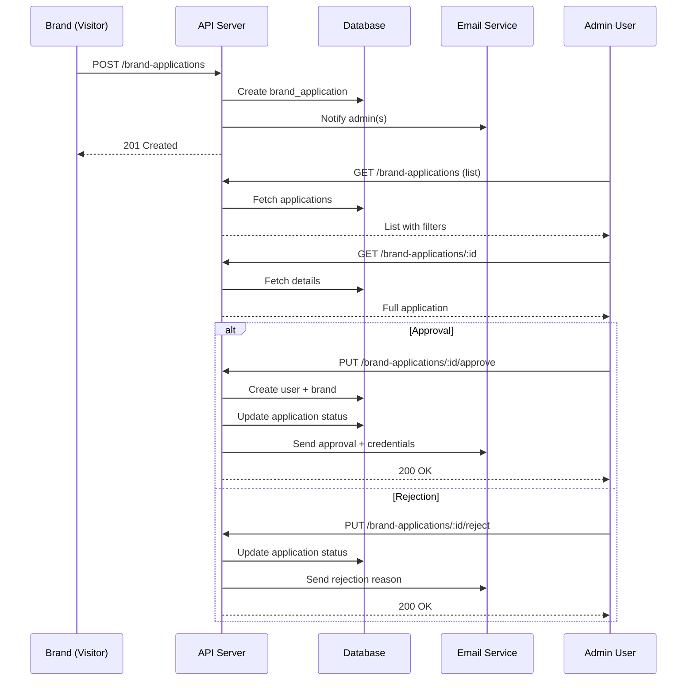

# Brand Applications API

This document describes the brand application system, which allows brands to apply to join the Mana Chain platform and enables administrators to review and approve/reject applications.

## Table of Contents

1. [Overview](#overview)
2. [Workflow](#workflow)
3. [Endpoints](#endpoints)
4. [Data Models](#data-models)
5. [Email Notifications](#email-notifications)
6. [Admin Guide](#admin-guide)

## Overview

The brand application system is a multi-step process:

1. A brand submits an application through a public endpoint
2. Administrators are notified via email
3. Administrators review the application in their dashboard
4. Administrators can approve or reject the application
5. Upon approval, a user account and brand profile are automatically created
6. The brand receives an email with their login credentials
7. Upon rejection, the brand receives an email with the rejection reason

## Workflow



## Endpoints

### 1. Create Brand Application

**Public endpoint** - No authentication required

```http
POST /brand-applications
Content-Type: application/json

{
  "contact_email": "contact@brand.com",
  "contact_first_name": "John",
  "contact_last_name": "Doe",
  "contact_phone": "+33612345678",
  "brand_name": "My Awesome Brand",
  "industry_type": "fashion",
  "description": "We create sustainable fashion...",
  "website_url": "https://mybrand.com",
  "logo_url": "https://mybrand.com/logo.png",
  "business_registration_number": "123456789",
  "country": "France",
  "headquarters_street": "123 Fashion Street",
  "headquarters_city": "Paris",
  "headquarters_zip_code": "75001",
  "headquarters_address_complement": "Building A",
  "registration_proof_url": "https://storage.com/proof.pdf",
  "motivation": "We want to build a community...",
  "estimated_community_size": 10000,
  "social_media_links": {
    "instagram": "https://instagram.com/mybrand",
    "twitter": "https://twitter.com/mybrand",
    "linkedin": "https://linkedin.com/company/mybrand"
  },
  "how_did_you_hear_about_us": "Social media"
}
```

**Response:**

```json
{
  "message": "Brand application submitted successfully",
  "application": {
    "id": "uuid",
    "status": "pending",
    "created_at": "2026-01-19T...",
    ...
  }
}
```

**Validations:**

- Email format must be valid
- `business_registration_number` must be unique
- `brand_name` must be unique (not exist in applications or brands)
- Required fields: contact_email, contact_first_name, contact_last_name, brand_name, industry_type, business_registration_number, country, headquarters_street, headquarters_city, headquarters_zip_code

### 2. List Brand Applications

**Admin only**

```http
GET /brand-applications?limit=20&offset=0&status=pending&search=brand
Authorization: Bearer <admin_token>
```

**Query Parameters:**

- `limit` (number, default: 20): Number of results per page
- `offset` (number, default: 0): Pagination offset
- `status` (string, optional): Filter by status (pending, approved, rejected, needs_review)
- `search` (string, optional): Search in contact_email or brand_name

**Response:**

```json
{
  "applications": [
    {
      "id": "uuid",
      "brand_name": "My Awesome Brand",
      "contact_email": "contact@brand.com",
      "status": "pending",
      "created_at": "2026-01-19T...",
      ...
    }
  ],
  "total": 50,
  "limit": 20,
  "offset": 0
}
```

### 3. Get Brand Application Details

**Admin only**

```http
GET /brand-applications/:id
Authorization: Bearer <admin_token>
```

**Response:**

```json
{
  "application": {
    "id": "uuid",
    "contact_email": "contact@brand.com",
    "contact_first_name": "John",
    "contact_last_name": "Doe",
    "brand_name": "My Awesome Brand",
    "status": "pending",
    "reviewed_by": null,
    "reviewed_at": null,
    "rejection_reason": null,
    ...
  }
}
```

### 4. Approve Brand Application

**Admin only**

```http
PUT /brand-applications/:id/approve
Authorization: Bearer <admin_token>
```

**Actions performed:**

1. Validates application status is `pending` or `needs_review`
2. Generates a secure random password (12 characters)
3. Creates a user account with:
   - Email from `contact_email`
   - Username generated from `brand_name`
   - Password (hashed)
   - `is_brand: true`
   - `role: BRANDUSER`
   - `verified: true` (pre-verified)
4. Creates a brand profile with all application data
5. Updates application status to `approved`
6. Sends approval email with credentials

**Response:**

```json
{
  "message": "Brand application approved successfully",
  "userId": "uuid",
  "brandId": "uuid"
}
```

**Error Cases:**

- Application not found (404)
- Application already approved/rejected (400)
- User creation failed (rollback)
- Brand creation failed (rollback user)

### 5. Reject Brand Application

**Admin only**

```http
PUT /brand-applications/:id/reject
Authorization: Bearer <admin_token>
Content-Type: application/json

{
  "rejection_reason": "The provided documents are not clear enough. Please submit higher quality scans."
}
```

**Actions performed:**

1. Validates application status is `pending` or `needs_review`
2. Updates application status to `rejected`
3. Records rejection reason
4. Sends rejection email with reason

**Response:**

```json
{
  "message": "Brand application rejected successfully"
}
```

## Data Models

### BrandApplication

```typescript
{
  id: string;
  
  // Contact Information
  contact_email: string;
  contact_first_name: string;
  contact_last_name: string;
  contact_phone: string | null;
  
  // Brand Information
  brand_name: string;
  industry_type: string;
  description: string | null;
  website_url: string | null;
  logo_url: string | null;
  
  // Legal Information
  business_registration_number: string;
  country: string;
  headquarters_street: string;
  headquarters_city: string;
  headquarters_zip_code: string;
  headquarters_address_complement: string | null;
  registration_proof_url: string | null;
  
  // Additional Information
  motivation: string | null;
  estimated_community_size: number | null;
  social_media_links: Record<string, string> | null;
  how_did_you_hear_about_us: string | null;
  
  // Review Information
  status: 'pending' | 'approved' | 'rejected' | 'needs_review';
  reviewed_by: string | null; // Admin user ID
  reviewed_at: string | null;
  rejection_reason: string | null;
  notes: string | null; // Internal admin notes
  
  created_at: string;
  updated_at: string;
}
```

### Status Workflow

- **pending**: Initial status when application is submitted
- **needs_review**: Admin has flagged for further review
- **approved**: Application approved, user/brand created
- **rejected**: Application rejected

⚠️ **Important**: Once an application is `approved` or `rejected`, it cannot be modified.

## Email Notifications

### 1. Admin Notification (New Application)

Sent to admin(s) when a new application is submitted.

**Recipients:** 
- `ADMIN_EMAIL` environment variable if set
- OR all users with `role = 'ADMIN'`

**Content:**
- Brand name, industry, contact info
- Link to review application

### 2. Approval Email (Brand Account Created)

Sent to the brand when their application is approved.

**Content:**
- Congratulations message
- Login credentials (username and generated password)
- Security notice (change password on first login)
- Link to login page
- Next steps guide

⚠️ **Security Note**: This is the only time the password is sent via email.

### 3. Rejection Email

Sent to the brand when their application is rejected.

**Content:**
- Polite rejection message
- Detailed rejection reason
- Encouragement to reapply after addressing concerns
- Link to submit new application
- Support contact

## Admin Guide

### Reviewing Applications

1. **Access the admin dashboard** and navigate to Brand Applications
2. **Filter by status** to see pending applications
3. **Click on an application** to see full details
4. **Review all information**:
   - Contact information
   - Brand details and description
   - Legal documents (registration proof)
   - Social media presence
   - Motivation and community size

### Approval Process

Before approving, verify:

- ✅ Business registration number is valid
- ✅ All required documents are provided
- ✅ Brand aligns with platform values
- ✅ Contact information is legitimate
- ✅ No duplicate or fraudulent applications

**To approve:**

```http
PUT /brand-applications/{id}/approve
Authorization: Bearer <admin_token>
```

The system will automatically:
- Create a user account
- Create a brand profile
- Generate and send credentials
- Mark application as approved

### Rejection Process

When rejecting, provide a clear, constructive reason:

✅ Good: "The business registration document is not legible. Please upload a higher quality scan or official certificate."

❌ Bad: "Documents unclear"

**To reject:**

```http
PUT /brand-applications/{id}/reject
Authorization: Bearer <admin_token>
Content-Type: application/json

{
  "rejection_reason": "Your detailed, constructive reason here"
}
```

### Setting Application Status to "Needs Review"

If you need time or want another admin to review:

```http
PUT /brand-applications/{id}
Authorization: Bearer <admin_token>
Content-Type: application/json

{
  "status": "needs_review",
  "notes": "Waiting for legal team verification"
}
```

### Best Practices

1. **Respond within 48 hours** of submission
2. **Be clear and constructive** in rejection reasons
3. **Document your decision** in internal notes
4. **Double-check credentials** are sent correctly
5. **Follow up** with new brands after approval

## Environment Variables

Required environment variables:

```env
# Admin notification email (optional, falls back to all admins)
ADMIN_EMAIL=admin@mana-chain.com

# Frontend URL for email links
FRONTEND_URL=https://mana-chain.com

# SMTP configuration (for emails)
SMTP_HOST=smtp.example.com
SMTP_PORT=587
SMTP_USER=noreply@mana-chain.com
SMTP_PASS=your_password
FROM_EMAIL=noreply@mana-chain.com
```

## Security Considerations

1. **Password Generation**: Uses crypto.randomBytes for secure random passwords (12 chars, mixed case, numbers, symbols)
2. **Username Uniqueness**: Automatically appends numbers if username exists
3. **Email Validation**: RFC-compliant email format validation
4. **Rollback on Failure**: If brand creation fails, user is deleted
5. **Admin-Only Access**: All review endpoints require ADMIN role
6. **Audit Trail**: All actions logged with reviewer ID and timestamp

## Error Handling

Common error responses:

```json
// Missing required fields
{
  "error": "Missing required fields",
  "required": ["brand_name", "contact_email"]
}

// Duplicate business registration
{
  "error": "This business registration number is already registered"
}

// Invalid status transition
{
  "error": "Only pending or needs_review applications can be approved"
}

// Authentication/Authorization
{
  "error": "Access reserved for administrators",
  "code": "ADMIN_ONLY"
}
```

## Rate Limiting

Consider implementing rate limiting on the public `/brand-applications` endpoint to prevent spam:

- Recommended: 5 applications per IP per day
- Or: Implement CAPTCHA verification
